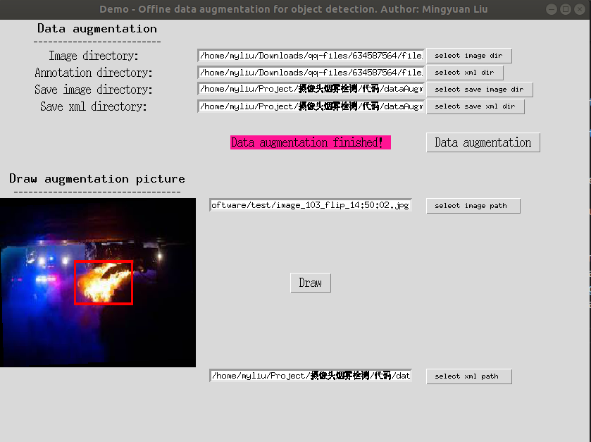

# 一个离线的目标检测数据增强软件





总共采用了五种类型的增强,分别是翻转(flip)\平移(translate)\颜色增强(enhance)\噪声(noise)\旋转(rotate)

- 翻转:随机进行上下或左右的翻转操作
- 平移:根据输入的平移系数进行平移
- 颜色增强:支持图片对比度\亮度\色度\锐度的增强
- 噪声:支持椒盐噪声和高斯噪声
- 旋转:支持任意角度的旋转

## 使用说明

软件上部分是选择需要增强的图片目录和增强后的图片保存目录,以及增强提示.

首先选择图片目录和标签目录,以及对应的保存目录. 

然后点击"Data augment"按钮开始增强,增强完毕后会显示"Data augment finished!"字样.

软件下部是显示增强后的图片以及对应边框.在"select image paht"按钮中选择图片路径,同时选择标签文件,点击draw按钮,可以对图片进行可视化.

## 依赖

只依赖于python原生库，不需要额外安装第三方库（如opencv）

## 使用方法

```bash
python interface.py
```